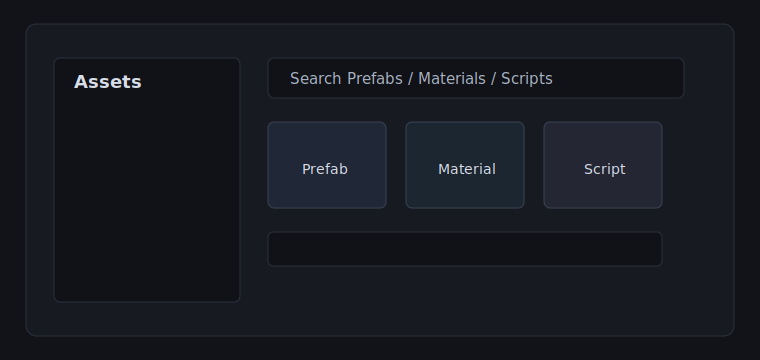

# Asset Browser Tools

Asset Browser Tools 是用于验证 Locus 插件 Hub 详情页的测试插件。它模拟一个轻量的 Unity 资产浏览辅助工具，用来检查中文详细描述、相对图片、表格和代码块在 Hub 中的渲染效果。

## 预期能力

- 汇总 Prefab、Material、Script 等常见资产入口
- 保留常用筛选条件，减少重复打开 Project 窗口的操作
- 将场景引用按目录和资产类型分组
- 用紧凑布局展示资产检查结果

## 测试覆盖

| 区域 | 期望行为 |
| --- | --- |
| 标题层级 | 使用插件详情页的中文排版 |
| 相对图片 | `docs/asset-browser-preview.svg` 按 README 位置解析 |
| 表格 | 在详情页内保持横向可读 |
| 行内代码 | `Assets/Characters/Hero.prefab` 使用文档样式 |

## 示例筛选

~~~json
{
  "filter": "type:Prefab path:Assets/Characters",
  "groupBy": "folder",
  "showDependencies": true
}
~~~

这个仓库只用于插件 Hub 注册表测试。实际下载安装包来自 release 或动态下载源，README 负责提供富文本详情内容。
